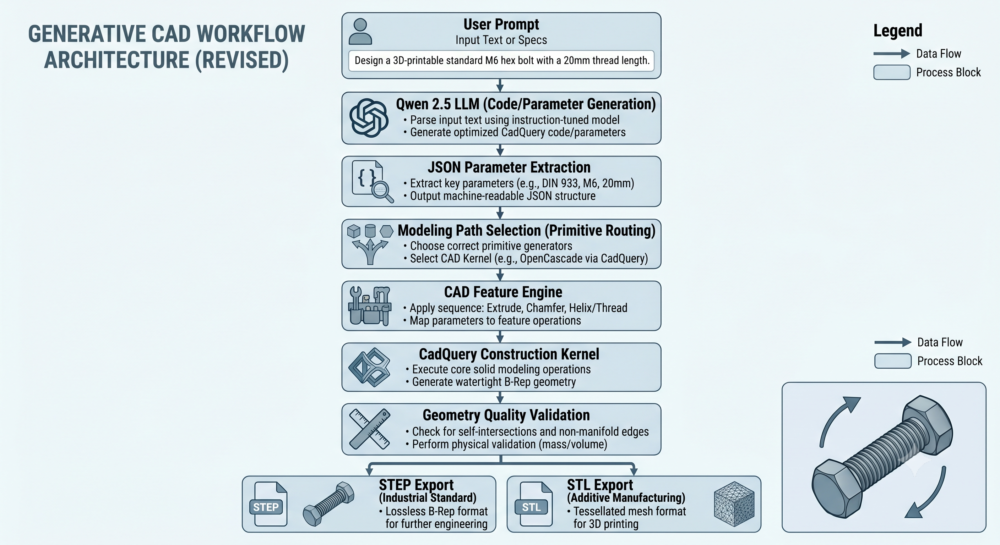
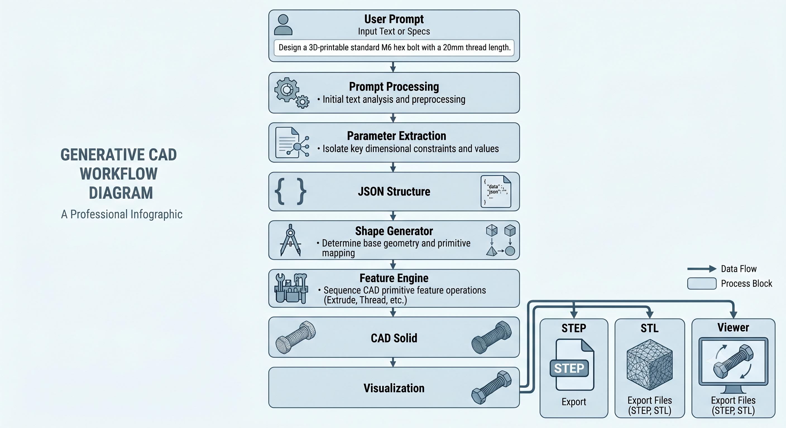
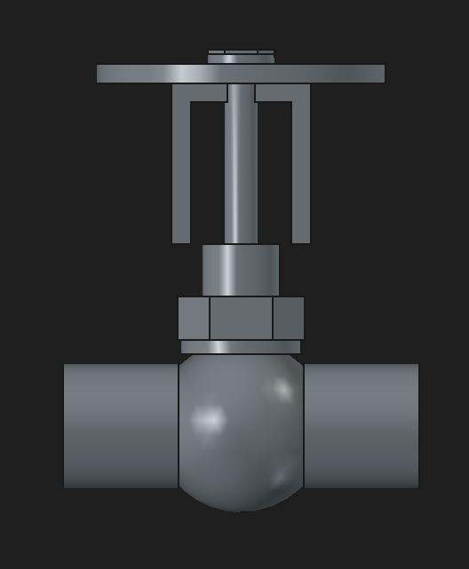
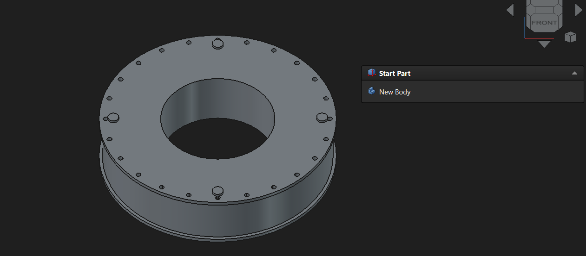
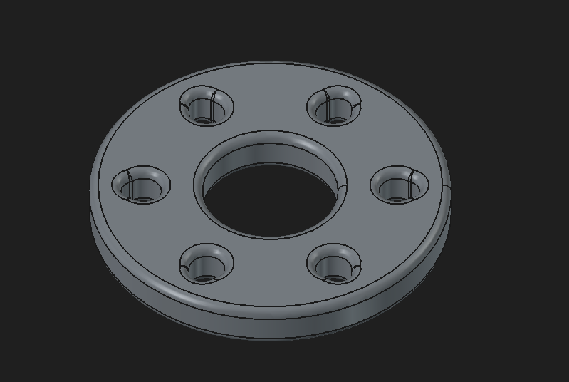
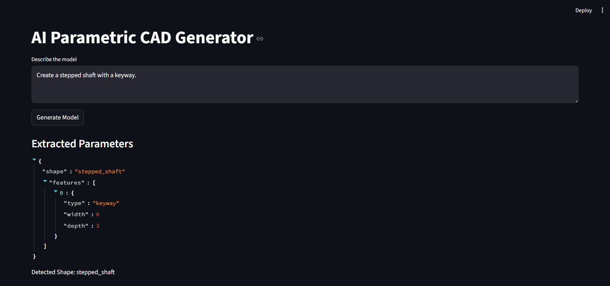
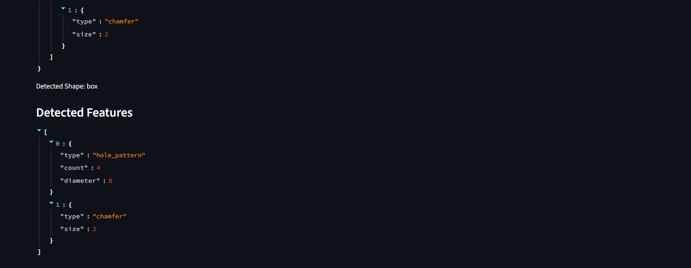
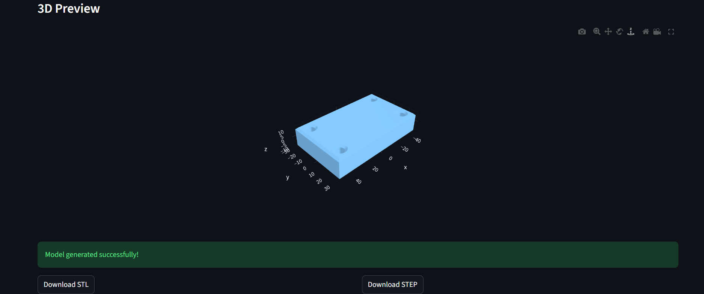

# AI Parametric CAD Generator

> Natural Language to Parametric CAD using Qwen 2.5, CadQuery, OpenCascade, and MCP-Inspired Multi-Agent Architecture.

## Overview

AI Parametric CAD Generator is an offline AI-powered engineering design system that converts natural language descriptions into manufacturable CAD models.

The system combines Large Language Models (LLMs), multi-agent orchestration, and parametric CAD generation to automate engineering workflows. Users can describe engineering components using plain English, and the system automatically generates valid CAD geometry with STEP and STL export support.

### Key Features

* Natural Language to CAD Generation
* Fully Offline Execution
* MCP-Inspired Multi-Agent Architecture
* Parametric CAD Modeling
* STEP Export Support
* STL Export Support
* Interactive 3D Visualization
* Geometry Validation
* Extensible Component Library

---

# System Architecture

<p align="center">
  
</p>

The architecture separates planning, validation, CAD generation, and geometry verification into specialized agents.

```text
User
 ↓
Streamlit UI
 ↓
MCP Orchestrator
 ↓
Planner Agent
 ↓
Validation Agent
 ↓
CAD Agent
 ↓
Geometry Agent
 ↓
CadQuery / OpenCascade
 ↓
STEP / STL Export
```

---

# CAD Generation Pipeline

<p align="center">
  
</p>

```text
Natural Language Prompt
          ↓
Qwen 2.5
          ↓
Structured JSON
          ↓
Validation Agent
          ↓
CAD Planning
          ↓
Feature Engine
          ↓
CadQuery Modeling
          ↓
Geometry Validation
          ↓
STEP / STL Export
```

---

# Technology Stack

| Layer                | Technology  |
| -------------------- | ----------- |
| AI Model             | Qwen 2.5    |
| Runtime              | Ollama      |
| UI Framework         | Streamlit   |
| CAD Framework        | CadQuery    |
| Geometry Kernel      | OpenCascade |
| Visualization        | Plotly      |
| Export Formats       | STEP, STL   |
| Programming Language | Python 3.11 |

---

# Supported Components

## Basic Components

* Box
* Cylinder
* Pipe
* Spacer
* Plate

## Intermediate Components

* Flange
* Shaft
* Pulley
* Mounting Plate

## Advanced Components

* Enclosure
* L-Bracket
* Clevis Bracket
* Globe Valve
* Tyre Mould

## Experimental Components

* Planetary Gear
* Engine Cylinder
* Impeller
* Spiral Staircase

---

# CAD Operations

| Category           | Operations                                       |
| ------------------ | ------------------------------------------------ |
| Primitives         | Box, Cylinder, Sphere, Cone                      |
| Boolean Operations | Union, Cut, Intersect, Fuse                      |
| Feature Operations | Fillet, Chamfer, Hole, Bolt Circle, Hole Pattern |
| Transformations    | Translate, Rotate, Mirror, Polar Array           |

---

# Generated Outputs

## Globe Valve

<p align="center">
  
</p>

Industrial globe valve generated using feature-based parametric modeling and solid fusion operations.

---

## Tyre Mould

<p align="center">
  
</p>

Industrial tyre mould with tread lug pattern generation, bolt-hole arrays, and manufacturing-oriented geometry.

---

## Flange

<p align="center">
  
</p>

Parametric flange with automated bolt circle and hole pattern generation.

---

# Validation Results

| Test Case   | Solid Count | STEP Export | STL Export | Status |
| ----------- | ----------- | ----------- | ---------- | ------ |
| Box         | 1           | PASS        | PASS       | PASS   |
| Flange      | 1           | PASS        | PASS       | PASS   |
| Globe Valve | 1           | PASS        | PASS       | PASS   |
| Tyre Mould  | 1           | PASS        | PASS       | PASS   |

Target Validation:

```text
Solid Count = 1
```

---

# User Interface

<p align="center">
  
</p>
<p align="center">
  
</p>
<p align="center">
  
</p>

Streamlit-based interface for Natural Language to CAD generation and interactive visualization.

---

# Installation

## Clone Repository

```bash
git clone https://github.com/YOUR_USERNAME/ai_parametric_cad.git
cd ai_parametric_cad
```

## Create Virtual Environment

```bash
python -m venv venv
```

## Activate Environment

Windows

```bash
venv\Scripts\activate
```

Linux / macOS

```bash
source venv/bin/activate
```

## Install Dependencies

```bash
pip install -r requirements.txt
```

---

# Ollama Setup

Install Ollama:

https://ollama.com

Pull Qwen:

```bash
ollama pull qwen2.5:3b
```

Verify:

```bash
ollama list
```

---

# Run Application

```bash
streamlit run app.py
```

Open:

```text
http://localhost:8501
```

---

# Example Prompts

```text
Create a flange with six bolt holes.

Create a stepped shaft with a keyway.

Create a globe valve with a handwheel.

Create an industrial tyre mould with tread lugs.

Create a centered 100 x 60 x 20 mm block with four 8 mm vertical through-holes. Add only a 2 mm chamfer on the top outer perimeter
```

---

# Current Limitations

* Single-part generation only
* No assembly constraints
* No FEA integration
* No topology optimization
* No Image-to-CAD support
* Limited engineering reasoning

---

# Future Roadmap

* Model Context Protocol (MCP)
* LangGraph Integration
* CrewAI Integration
* Image-to-CAD Generation
* Retrieval-Augmented CAD (RAG-CAD)
* Assembly Generation
* FEA Integration
* Autonomous CAD Agents
* Generative Engineering Design

---

# Project Outcomes

* Natural Language to CAD Workflow
* Fully Offline AI Inference
* Parametric CAD Generation
* STEP/STL Export Support
* Industrial Component Generation
* Multi-Agent CAD Architecture

---

# Author

**Muhammed Zachariya**

B.Tech Computer Science and Engineering

AI Parametric CAD Generator – Natural Language to Parametric CAD using Qwen, CadQuery, and OpenCascade.
